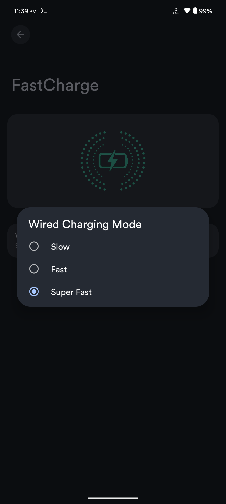
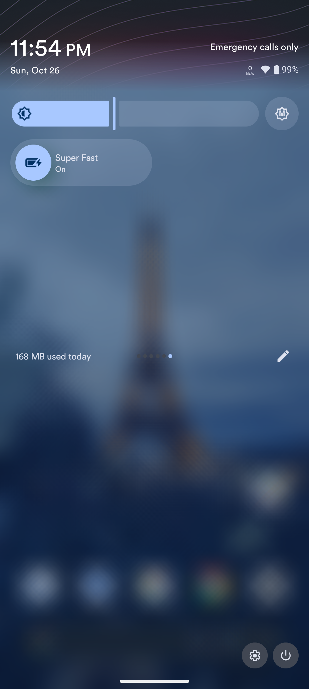

# FastCharge for Poco F6 (peridot)

[](https://opensource.org/licenses/Apache-2.0)
[](https://www.android.com)
[](https://android-arsenal.com/api?level=36)
[](https://www.mi.com/poco-f6)

A modern Android system app for controlling charging speeds on Xiaomi Poco F6 (peridot) with Material Expressive design.

## Overview

FastCharge provides a user-friendly interface to control your device's charging speed through three distinct modes. Built with Material Design 3 expressive theme, it seamlessly integrates into Android Settings and Quick Settings tiles.

## Features

- 🎨 **Material Expressive Design** - Modern UI following Material Design 3 guidelines
- ⚡ **Three Charging Modes** - Slow, Fast, and Super Fast charging
- 🎯 **Quick Settings Tile** - Easy access from notification shade

## Integration

### 1. Clone the Repository

```bash
git clone https://github.com/poco-f6-peridot/packages_apps_FastCharge -b master packages/apps/FastCharge
```

### 2. Add to Device Makefile

Add the following line to your device's `device.mk`:

```makefile
# FastCharge
$(call inherit-product, packages/apps/FastCharge/fastcharge.mk)
```

### 3. Build ROM

```bash
# Build the entire ROM
m bacon
```

## Screenshots

<p align="center">
  
  
  
  
</p>

## Charging Modes

| Mode | sport_mode | smart_chg |
|------|------------|-----------|
| **0 - Slow** | 0 | 0 |
| **1 - Fast** | 0 | 8 |
| **2 - Super Fast** | 1 | 8 |

## Kernel Patches Required

The following kernel commits are required for FastCharge to function:

1. **Initial FastCharge Implementation**
   - [f3aaa4e](https://github.com/peridot-hyperos-2/android_kernel_xiaomi_sm8635/commit/f3aaa4e44a53bbcca204a8116e5812c44fad08ef)
   - Adds basic fastcharge_enable node

2. **Multi-Mode Support**
   - [9a9433f](https://github.com/peridot-hyperos-2/android_kernel_xiaomi_sm8635/commit/9a9433fd446d238bf0d61476366758787da8349b)
   - Implements 3-mode charging system

3. **Mode Detection Fix**
   - [91d1834](https://github.com/peridot-hyperos-2/android_kernel_xiaomi_sm8635/commit/91d1834fdd5b0f8cef7389df8c066d5865049639)
   - Fixes mode 1 detection for Xiaomi hardware quirk

## Usage

### Settings App
1. Open **Settings** → **Battery**
2. Tap **Fast Charge**
3. Select your preferred charging mode
4. The illustration updates to reflect your choice

### Quick Settings Tile
1. Pull down notification shade
2. Edit tiles and add **Fast Charge**
3. Tap the tile to cycle through modes:
   - Slow → Fast → Super Fast → Slow


## Credits

- **Developer**: kenway214
- **Device**: Xiaomi Poco F6 (peridot)
- **Original Concept**: [YAAP FastCharge](https://github.com/yaap/packages_apps_FastCharge)
- **Inspiration**: Xiaomi TurboCharging implementation
- **Design**: Material Design 3 Expressive theme

## Contributing

Contributions are welcome! Please feel free to submit pull requests or open issues for bugs and feature requests.

---

**Made with ⚡ for Poco F6 (peridot)**
